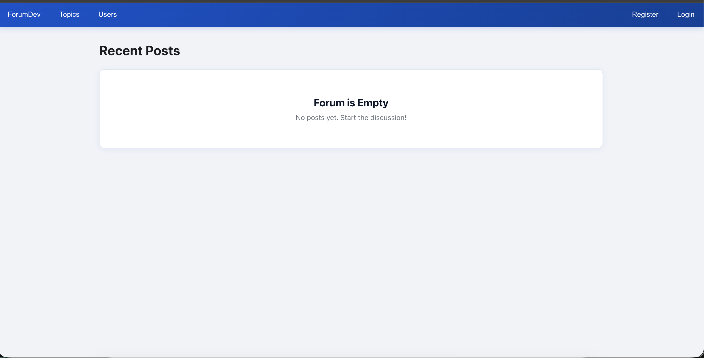

# ForumDev
Forum app development project

This is a general forum app that allows users to create topics (much like sub-reddits) to engage in discussion with the forum's community. Creators of the topic is able to manage posts and comments on their topic, allowing them to delete posts and comments that they deem unsuitable for the topic.
Users are also able to freely post on topics and comment under posts to exp to engage in discussions with the topic's community.

The application is only tried and tested on local machines and is yet to be deployed on the web. As such, instructions will be provided to run this application on your local browser.

## Getting Started

### Running the app:
1. Install [Docker Desktop](https://www.docker.com/products/docker-desktop/) on your machine
2. [Fork](https://docs.github.com/en/get-started/quickstart/fork-a-repo#forking-a-repository) this repo.
3. [Clone](https://docs.github.com/en/get-started/quickstart/fork-a-repo#cloning-your-forked-repository) **your** forked repo.
4. Open your terminal and navigate to the directory containing your cloned project.
5. Create .env files under the frontend directory and in the main dicectory with the provided .env.example
6. Run the app in development mode by entering this command:

```bash
docker compose up --build
```

7. Open [http://localhost:5173](http://localhost:5173) to view it in the browser.
8. You should see a page like this.
   
   
## Acknowledgements

This project was bootstrapped with [Create Vite](https://github.com/vitejs/vite/tree/main/packages/create-vite).
This project utilised AI (in vscode) for its stylings
This project utilised ChatGPT in identifying weaknesses in the code logic.